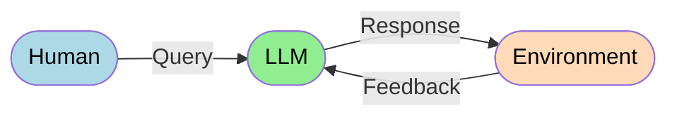

# A Take on Agents in Helpdesk

It is evident that the capabilities of AI agents are expanding rapidly. With the latest advancements in LLMs like Claude 3.7 Sonnet, there is real potential for agents to have a significant impact on environments like helpdesk. The concept of having an autonomous team member that is available 24/7, has access to a vast amount of data from not only the internet but also an internal knowledge base, can use tools, and is able to interact with the end-user in natural language to collect more information about the issue and then take actions to resolve it is very appealing.

In 2024, the global AI agent market size and share was valued at $5.29 billion USD and is expected to grow to a whopping $216.8 billion USD by 2035, according to Roots Analysis [1](https://www.rootsanalysis.com/ai-agents-market).

However, there are still many challenges that need to be addressed and considered before we can reach the point where agents are truly useful.

## Let's Get Some Context

Before anything, I think we need to establish some high-level context about what an agent is and how it differs from a modern AI assistant.

In short, an agent is an LLM that has access to tools and runs on a loop until it finds an answer or a solution to the problem. In other words, the LLM decides how many steps it needs to take to solve the problem; there is no predefined sequence of steps that the LLM must follow.

The key difference between an agent and a workflow that leverages LLMs lies in its architectural design. A workflow with tools is an environment where the LLM follows a set of instructions to complete a task, where it is not able to make decisions on its own but simply follows the next step in the workflow. On the other hand, an agent is given an environment where it has access to tools and can use them as it sees fit to complete the task. There is no predefined sequence of steps that the LLM needs to follow; it is simply given a goal and must complete the task by using the available tools.

> *Anthropic released a paper *Building Effective Agents* [2](https://www.anthropic.com/research/building-effective-agents), where they describe in depth their experience with their clients and the key differences between an agent and a workflow. I highly recommend reading it.*

## Tools

With the current state of LLMs, we have seen major improvements in reasoning capabilities and output quality, but there is still the data problem. Models are able to reason about the data they have access to, but they cannot use data they don’t have access to. This is where tools come into play.

There has been a lot of work using RAG (Retrieval Augmented Generation) to address this problem by giving the model access to a vector database of information that can be used to answer questions—a resource that was not available to the model before. However, this is only part of this multi-dimensional problem. Just like a human, the agent needs to be able to use a set of tools that can address the problem from different angles, each aggregating information to form a complete picture of the issue.

So... the problem here is the fact that there are no standards, no common way to build tools that can be used by an agent. That is not the case anymore, though. With the release of **Model Context Protocol** [3](https://www.anthropic.com/news/model-context-protocol) by Anthropic in late 2024, we are starting to see a standard way to build tools that can be used by an agent, which is a leap forward in the agent ecosystem.

MCP is the missing link for connecting AI assistants to the systems where data lives in a secure manner—a global standard for connecting these systems with data sources, making it easier to build agents that can use these tools to solve complex problems.

## Where does the agent fit in the helpdesk?

I have been really excited about the latest developments in MCP and how I can use it to build agents that can tackle real problems that end-users face in an organizational environment—those day-to-day problems that are not easily solved by an AI assistant since it doesn’t have access to the infrastructure environment where the data lives.

If we can build agents that can interact within the organization’s environment (a limited environment) with a set of tools that demonstrate procedures and policies, while having a human in the loop to approve deterministic actions, IT teams can have a real assistant that can provide lightning-speed support to end-users with a high level of accuracy and consistency.

A sensible person reading this might be thinking:

- *"How much data should the agent have access to?"*
- *"What if the agent exposes sensitive information to the end-user?"*
- *"How can we ensure that the agent is not violating the organization’s policies?"*

That’s the key point here: the agent needs to be able to access the data it requires to solve the problem, but it also needs to interact with the environment in a way that is safe and compliant with the organization’s policies. We don’t want to expose confidential information to the agent, but we also want to ensure that the agent can solve the problem at hand without exposing the organization to any risk or leaks, especially when it comes to PII (Personally Identifiable Information) and PHI (Protected Health Information), or even technical information that could be used to exploit the system, like servers’ IP addresses, usernames, passwords, etc.

## Conclusion

Agents are a powerful tool that can be used to solve complex problems in an organizational environment, but it is important to understand the key differences between an agent and a workflow and how to build tools that an agent can use.

I am really excited about the potential of agents to transform the way we build and deliver support to end-users, and I am looking forward to building on top of MCP and improving the way helpdesk teams operate to provide a better experience for end-users.

## References

[1] https://www.rootsanalysis.com/ai-agents-market

[2] https://www.anthropic.com/research/building-effective-agents

[3] https://www.anthropic.com/news/model-context-protocol
