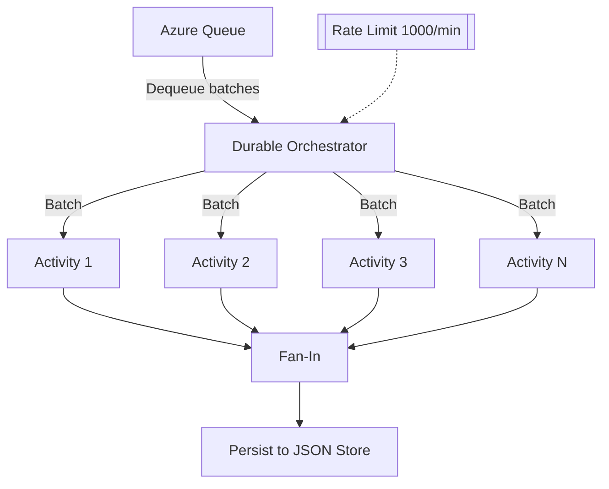

# Scaling with Grace: Fan-Out and Fan-In in Azure Durable Functions

When working with pipelines that handle massive amounts of data, the challenge is rarely *just* about making things faster — it’s about scaling **intelligently**. Recently, I implemented a pattern that allowed me to process large workloads efficiently while respecting strict API limits: **Fan-Out and Fan-In**.

## Why Fan-Out and Fan-In?

The problem space was familiar:

- A large backlog of work, represented as messages in a queue.  
- Each message requiring an HTTP call to an external API.  
- The API having strict concurrency and rate limits (1,000 items/minute).  

Running these requests sequentially wasn’t an option — the data set was *huge* (think hundreds of gigabytes), and we needed speed. At the same time, a “just blast everything in parallel” approach would have broken the API and caused unnecessary failures.  

The **fan-out/fan-in** pattern offered the balance I needed:  

1. **Fan-Out:** Process items in parallel, but within a fixed concurrency cap.  
2. **Fan-In:** Wait for all parallel tasks to finish, then aggregate results.

## Architecture Diagram

In my implementation, each orchestration in Azure Durable Functions took up to ten queue messages at a time. This batching kept concurrency predictable, avoided overwhelming the API, and still processed work quickly. All the heavy lifting happened during the fan-out phase — each batch item was sent as a separate HTTP request, the response was transformed, and if an API call failed, a retry mechanism with exponential backoff (up to five attempts) handled it gracefully. This approach made the system resilient to rate-limit errors and network hiccups.

The fan-in phase was simple but essential. Once all the calls in a batch completed, it produced a clean map of each item and its final status. Because the processing happened earlier, this step was mostly about gathering and finalizing results. Azure Durable Functions shined here — the state of each orchestration persisted automatically, so even if something restarted, the process picked up exactly where it left off.

This approach worked because it combined scale, reliability, and respect for external systems. Azure handled orchestration scaling for me, so I could focus on logic instead of infrastructure. The concurrency caps and retry policies kept the pipeline API-friendly, while state persistence meant no wasted processing. Sequential processing would have been far too slow. Unbounded parallelism would have been reckless. Fan-out/fan-in was the perfect middle ground: high throughput, controlled load.

What I like most about this pattern is how it turns parallelism into something disciplined rather than chaotic. It’s not about brute-forcing performance; it’s about coordinating tasks so they move fast without stepping on each other’s toes. In my case, this meant processing half a terabyte of data in a way that was both fast and stable — and that’s exactly what good design patterns are for.

## Final Thoughts

The fan-out/fan-in pattern isn’t new, but what made it powerful here was how seamlessly it integrated into Azure Durable Functions. By batching intelligently, handling retries gracefully, and letting Azure manage orchestration at scale, I could process **half a terabyte of data** in a way that was both fast and stable.

When used thoughtfully, fan-out/fan-in isn’t just about parallelism — it’s about **respecting limits while still moving fast**.
