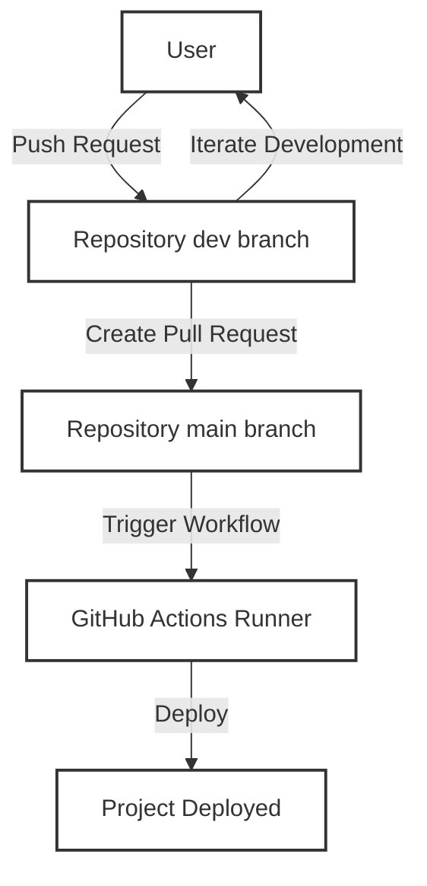

# Leveraging GitHub Self-Hosted Runners for CI/CD in a Home Lab

Github Actions with Self-hosted Runners in a Home Lab is a very powerful way to introduce CI/CD in a Home Lab environment for personal projects and get your feet wet with the latest CI/CD tools and practices.

One of my first experiences with deploying a proper CI/CD pipelines without having to pay for a cloud service like AWS or GCP was simply automating the deployment process of this portifolio website.

---


You may be asking yourself; why would I want to deploy a CI/CD pipeline in a Home Lab? What's the benefit?

In my view, the best thing you can do with a home lab is to test stuff out, break things, fix them, and learn! When you don't have the fear of breaking something in prod at a intership or job, you can really let your imagination run wild and test out things you would never dare to try in a production environment.


## Github Self-Hosted Runners

> Reference: [Github Self-hosted Runners](https://docs.github.com/en/actions/hosting-your-own-runners/about-self-hosted-runners)

There are two options whenever adding a runner to your project, you can either configure a *repository-specific* runner or a *organization-wide* runner.

- Repository-specific runners are scoped to a single repository and are not available to other repositories.

- Organization-wide runners are available to all repositories in the organization.

A important point to note is to run the runner as a **service**, otherwise it will be stopped when the runner is not in use.

### `.yaml` as Instructions

The runner will run the jobs defined in the `.yaml` file, this is the instructions for the runner to follow when a workflow is triggered.

As a simple example, let's say you have a project that you want to be deployed whenever there is a push to the `main` branch.

```yaml
name: Deploy Project

on:
  push:
    branches: [ "main" ] # This is the branch that will trigger the workflow

jobs:
  deploy:
    runs-on: self-hosted # This is the runner that will be used to run the job

    steps:
    - name: Checkout code
      uses: actions/checkout@v4
      with:
        ref: ${{ github.event.pull_request.head.sha }}
        fetch-depth: 0  # Fetch all history and tags
```

---


A proper CI/CD pipeline should make your life easier, not harder.

You should be able to add new code to your project's *main* branch and have it deployed to a staging environment automatically. This way you can focus on adding new features and improvements without having to worry about the deployment process.

Perhaps a better way to explain this is by using a diagram:



The user can do local development on the `dev` branch and whenever ready, create a pull request to the `main` branch that will trigger the CI/CD pipeline using the self-hosted runner.

## Conclusion

There is a lot more to CI/CD pipelines than Github Actions and self-hosted runners, but this is great cost effective way to practice and get your feet wet with the latest CI/CD tools and practices.

Tools like this are essential for production environments, but in a home lab environment, you can use them to test out new ideas and concepts without having to worry about breaking something in production.